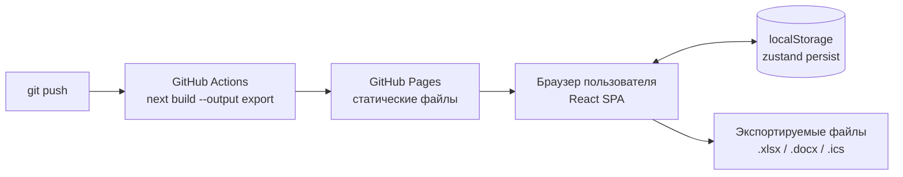
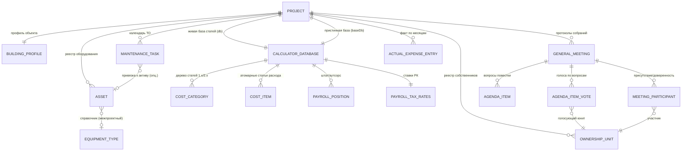
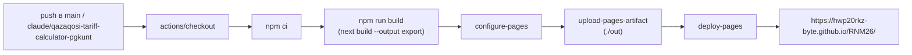

# QazaqOSI — архитектура приложения (as-built)

Документ для внешней технической аналитики. Описывает фактическое состояние кода в ветке
`claude/qazaqosi-tariff-calculator-pgkunt` на 2026-09-11, а не план или намерение — каждый
раздел проверяем по исходникам репозитория `hwp20rkz-byte/RNM26`.

Живой инстанс: https://hwp20rkz-byte.github.io/RNM26/

---

## 1. Назначение

Интерактивный калькулятор годовой сметы и тарифа на управление и содержание кондоминиума
для ОСИ/ПТ в Казахстане, реализующий формулу Приказа МИИР РК №166 от 30.03.2020
(`В = (Ргод − Дгод) / (Sполез × 12)`), плюс операционные модули, которые обычно требуются
председателю ОСИ на практике: реестр собственников с кворумом, план капремонта, календарь
регламентных работ, сверка план/факт, конструктор протокола общего собрания.

Пользователь — председатель ОСИ/ПТ или бухгалтер, работающий в браузере без ИТ-поддержки.

---

## 2. Архитектурный тип: client-only SPA, без бэкенда

Это принципиальное и осознанное архитектурное решение, а не временное упрощение:

- Next.js собирается в статический экспорт (`output: "export"` в `next.config.ts`) — на
  выходе набор HTML/JS/CSS файлов, без Node-сервера в проде.
- Хостинг — GitHub Pages (бесплатный статический хостинг), деплой через GitHub Actions при
  каждом push в `main` или рабочую ветку (`.github/workflows/deploy-pages.yml`).
- Данных на сервере нет вообще. Все данные (проекты, сметы, реестр собственников, протоколы,
  фактические расходы) хранятся в `localStorage` браузера конкретного пользователя.
- Следствия, которые нужно понимать любому, кто оценивает продукт:
  - **Нет синхронизации между устройствами.** Данные, введённые на одном компьютере/браузере,
    не видны на другом.
  - **Нет многопользовательского доступа в реальном времени.** Председатель и бухгалтер не
    могут одновременно редактировать один и тот же проект с автоматическим слиянием.
  - **Нет аутентификации и разграничения прав** — кто открыл страницу, тот и полный
    администратор данных в своём браузере.
  - **Риск потери данных** при очистке данных сайта / смене браузера — единственный способ
    сохранности данных — явный экспорт (Excel/Word) пользователем.
  - Обратная сторона: **нулевая стоимость инфраструктуры**, нет юридических рисков хранения
    персональных данных собственников на стороннем сервере (всё остаётся у председателя
    локально), простой деплой.

---

## 3. Технологический стек

| Слой | Технология | Версия |
|---|---|---|
| Фреймворк | Next.js (App Router, Turbopack) | 16.3.4 |
| UI-библиотека | React | 19.2.8 |
| Язык | TypeScript | ^5 |
| Стили | Tailwind CSS | v4 |
| Состояние | Zustand (+ `persist` middleware) | ^5.0.15 |
| Валидация форм | Zod | ^4.6.1 |
| UI-примитивы | Radix UI (accordion, dialog, select, switch, tabs, tooltip) | — |
| Графики | Recharts | ^3.10.1 |
| Экспорт Excel | ExcelJS | ^4.4.0 |
| Экспорт Word | `docx` | ^9.7.1 |
| Иконки | lucide-react | — |
| Тесты | Vitest (+ jsdom для DOM/File-зависимых тестов) | ^2.1.9 |
| E2E/смоук | Playwright (ad hoc, не входит в CI) | ^1.63.0 |
| CI/CD | GitHub Actions → GitHub Pages | — |

Зависимостей на бэкенд-фреймворки, ORM, БД — нет. Проект не тянет ни одной серверной
зависимости; весь runtime — браузерный JS-бандл.

---

## 4. Доменная модель данных

Корневая сущность — `Project` (один расчётный объект: дом/ЖК). Всё состояние приложения —
это `Record<string, Project>` плюс несколько межпроектных справочников.

Межпроектные (глобальные, не входят в `Project`) сущности верхнего уровня стора:

| Сущность | Назначение |
|---|---|
| `catalog: CatalogEntry[]` | Справочник материалов/услуг, переиспользуемый между всеми проектами (загружается из прайс-листов) |
| `presets: ServicePreset[]` | Пресеты обслуживания (Эконом/Комфорт/Бизнес/Премиум + пользовательские) |
| `equipmentTypes: EquipmentType[]` | Справочник нормативных сроков службы оборудования |
| `savedSmetas: Record<string, SavedSmeta>` | Замороженные версии сметы (снапшоты) |

Полное определение всех типов — `src/lib/calculator/types.ts` (516 строк, единственный
источник истины по доменной модели).

---

## 5. Функциональные модули (что реально считает каждая вкладка)

Приложение — одна страница (`src/app/page.tsx`) с 8 вкладками верхнего уровня; каждая
опирается на отдельный «движок» — чистую функцию/набор функций без побочных эффектов в
`src/lib/calculator/*.ts`, покрытую unit-тестами независимо от UI.

| Вкладка | Компонент | Движок (чистая логика) | Что считает |
|---|---|---|---|
| Конструктор | `CostCategoryTree.tsx` | `engine.ts` | Дерево статей 1.x (управление) / 2.x (содержание) по номенклатуре Приказа №166, инлайн-редактирование, formula-расчёт налогов на ФОТ (`payrollTax.ts`) |
| Справочник | `PriceCatalog.tsx` | `parsePriceList.ts` | Импорт прайс-листов CSV/XLSX с гибким распознаванием колонок, переиспользуемая база материалов |
| Пресеты | `PresetEditor.tsx` | `engine.ts` (`applyPreset`) | Единая настройка класса обслуживания: одновременно множитель цен, потолок доступных статей, взнос на капремонт, коэффициент для нежилых |
| Износ и капремонт | `AssetRegistry.tsx`, `EquipmentTypeCatalog.tsx`, `ReplacementPlan.tsx` | `wearEngine.ts` | Линейный износ по возрасту/нормативному сроку, план замены на 3/5/10 лет, проекция фонда капремонта (потребность vs накопление при текущем взносе) |
| Собственники | `OwnerRegistry.tsx` | `ownerRegistryEngine.ts` | Реестр помещений (квартиры/НП/кладовые/машиноместа), доля голосов и начислений по площади, импорт/экспорт Excel-ведомостей |
| Календарь ТО | `MaintenanceCalendar.tsx` | `maintenanceCalendar.ts` | Дата следующего ТО = последнее + периодичность, статусы ok/скоро/просрочено, экспорт `.ics` |
| План/факт | `BudgetActual.tsx` | `planVsActual.ts` | Сравнение расчётного плана (из сметы) и введённых фактических расходов по месяцам/статьям |
| Протокол собрания | `ProtocolBuilder.tsx` | `ownerRegistryEngine.ts` + `wearEngine.ts` + `maintenanceCalendar.ts` | Кворум и голосование от площади (простое/квалифицированное большинство), сборка итогового документа с интеграцией показателей из других модулей |

Все движки — чистые TypeScript-функции без React и без доступа к store: `computeTariff`,
`computeQuorum`, `computeAssetWear`, `computeMaintenanceStatus` и т.д. принимают данные на
вход и возвращают результат, что и позволяет тестировать их изолированно от UI (раздел 8).

---

## 6. Управление состоянием и персистентность

Единый store — `src/store/useProjectsStore.ts` (1030 строк, Zustand + `persist`
middleware, ключ localStorage `qazaqosi-projects-v1`).

- **49 экшенов** в публичном интерфейсе `ProjectsState` — CRUD по каждой сущности домена
  (проекты, статьи, персонал, справочник, активы, юниты реестра, собрания/голосование,
  задачи ТО, факт-записи) плюс операции над сметами (сохранить/восстановить снапшот).
- Гидратация — `skipHydration: true` + ручной вызов `useProjectsStore.persist.rehydrate()`
  в `useEffect` на клиенте, чтобы избежать SSR/CSR-рассинхрона Next.js при статическом
  экспорте.
- **Версионированные миграции** (`version: 3`, поле `migrate` в конфиге persist) — при
  каждом расширении доменной модели (например, добавление `units`/`meetings` в `Project`)
  добавлен шаг миграции `if (version < N)`, который достраивает отсутствующие поля пустыми
  массивами/значениями по умолчанию для уже сохранённых у пользователей данных. История
  миграций:
  - v0→v1: `project.scenario` (строка) → `presetId` (ссылка на `ServicePreset`)
  - v1→v2: добавлены `assets[]`, `capitalFundBalance`, справочник `equipmentTypes`
  - v2→v3: добавлены `units[]`, `meetings[]`, `maintenanceTasks[]`, `actuals[]`

Это значит: у пользователя, открывшего приложение после обновления, старые локальные данные
не теряются — миграция досоздаёт недостающие поля прозрачно при следующей загрузке.

---

## 7. Экспорт/импорт (файловый интеграционный слой)

Поскольку бэкенда и API нет, весь обмен с внешним миром — через файлы:

| Направление | Формат | Модуль | Назначение |
|---|---|---|---|
| Импорт | .csv / .xlsx | `parsePriceList.ts` | Прайс-листы поставщиков → справочник |
| Импорт | .csv / .xlsx | `parseOwnersList.ts` | Ведомости ЕРЦ/1С → реестр собственников |
| Экспорт | .xlsx | `exportToExcel.ts` | Полная смета с формулами |
| Экспорт | .xlsx | `exportOwnersToExcel.ts` | Ведомость собственников с начислениями (совместима по заголовкам с импортом — раунд-трип) |
| Экспорт | .xlsx | `exportCapitalPlanToExcel.ts` | План капремонта по годам |
| Экспорт | .docx | `exportToDocx.ts` | Официальный документ сметы на утверждение |
| Экспорт | .docx | `exportCapitalPlanToDocx.ts` | Перспективный план капремонта |
| Экспорт | .docx | `exportProtocolToDocx.ts` | Протокол общего собрания с кворумом, голосованием, сводкой критичных показателей |
| Экспорт | .ics | `exportToIcs.ts` | Календарь регламентных работ (для Google/Outlook/Apple Calendar — реальный канал напоминаний без бэкенда) |
| Экспорт | PDF | `window.print()` + print-стили | Печать любого раздела |

---

## 8. Тестовое покрытие

**123 unit-теста в 10 файлах** (Vitest), запускаются командой `npm test`, независимо от UI:

| Файл | Тестов | Покрывает |
|---|---|---|
| `payrollTax.test.ts` | 5 | Налоговый движок ФОТ РК |
| `engine.test.ts` | 16 | Формула тарифа, категории, пресеты |
| `wearEngine.test.ts` | 15 | Износ, план замены, проекция фонда |
| `ownerRegistryEngine.test.ts` | 13 | Кворум, голосование, начисления по юнитам |
| `maintenanceCalendar.test.ts` | 10 | Даты ТО, статусы просрочки |
| `planVsActual.test.ts` | 7 | План/факт по категориям и месяцам |
| `parsePriceList.test.ts` | 5 | Парсер прайс-листов |
| `parseOwnersList.test.ts` | 4 | Парсер ведомостей собственников |
| `exportProtocolToDocx.test.ts` | 3 | Генерация docx-протокола не падает на пустых/заполненных данных |
| `useProjectsStore.test.ts` | 45 | CRUD store по всем сущностям, миграции |

UI/браузерное поведение проверяется вручную через Playwright-смоук перед каждым коммитом
(не входит в постоянный CI — это ручная практика в разработке, не автоматический гейт).
Постоянный CI-гейт — только сборка (`next build` внутри `deploy-pages.yml`); отдельного
workflow для `npm test`/`npm run lint` в CI на момент документа нет — они выполняются
локально разработчиком перед пушем.

---

## 9. CI/CD и деплой

- `basePath`/`assetPrefix` = `/RNM26` включаются условно, только когда `GITHUB_ACTIONS=true`
  (`next.config.ts`) — локальная разработка (`npm run dev`) не задевается этим хаком.
- Деплой полностью автоматический: пуш в рабочую ветку = обновление прод-сайта, без ручного
  шага.

---

## 10. Ограничения и риски (для честной оценки продукта)

1. **Отсутствие бэкенда — фундаментальный, а не временный выбор.** Любой сценарий
   «несколько пользователей редактируют один объект одновременно», «доступ с телефона и
   компьютера синхронно», «аудит: кто и когда изменил смету» — сейчас невозможен
   архитектурно, не просто не реализован. Добавление такого сценария означает не доработку,
   а смену архитектуры (нужен бэкенд + БД + auth).
2. **Регуляторная точность требует ручной сверки.** Часть числовых ориентиров (рыночные
   расценки на материалы 2025-2026 гг., минимальные тарифы маслихатов по регионам,
   нормативные сроки службы оборудования, отличные от лифтов) помечены в коде и UI как
   справочные/индикативные — источник указан в каждом кейсе (`source`/`tooltip` поля в
   доменной модели), но не является юридически подтверждённым НПА-текстом. Единственная
   позиция с юридически обязательным значением, зашитая в код с явной ссылкой, — срок службы
   лифтов 25 лет по ТР ТС 011/2011.
3. **Нет server-side валидации.** `zod`-схема (`validation.ts`) валидирует только форму
   профиля объекта на клиенте; остальные сущности (реестр собственников, факт-записи и т.д.)
   принимают данные без строгой схемной проверки — при работе с большими файлами импорта
   некорректные строки просто пропускаются (`skipped` счётчик), а не выбрасывают ошибку.
4. **Единый store-файл (1030 строк).** Все 49 экшенов живут в одном `useProjectsStore.ts`
   без разбиения на слайсы — рабочее решение при текущем размере домена, но с дальнейшим
   ростом функциональности потребует рефакторинга на модульные слайсы Zustand, иначе
   поддерживаемость файла деградирует.
5. **Постоянного автоматического CI-гейта для тестов/линта нет** — только сборка. Регресс в
   `npm test` не заблокирует деплой сам по себе, если разработчик не прогнал тесты вручную
   перед пушем.

---

## 11. Масштаб кодовой базы (снимок на дату документа)

- Исходный код: ~70 файлов `.ts`/`.tsx` в `src/`
- Доменная модель: `types.ts` — 516 строк, единый источник истины
- Стор: `useProjectsStore.ts` — 1030 строк, 49 экшенов
- Тесты: 123 теста в 10 файлах
- Экспортных форматов: 4 (xlsx, docx, ics, PDF-печать)
- Импортных форматов: 2 (прайс-листы, ведомости собственников), оба CSV+XLSX
- Внешние зависимости: 0 серверных, ~20 клиентских npm-пакетов

---

*Документ описывает состояние кода, не является маркетинговым материалом. При использовании
для инвестиционной/технической due diligence — сверяйте актуальность с `git log` репозитория
на дату проверки, так как проект активно развивается.*
