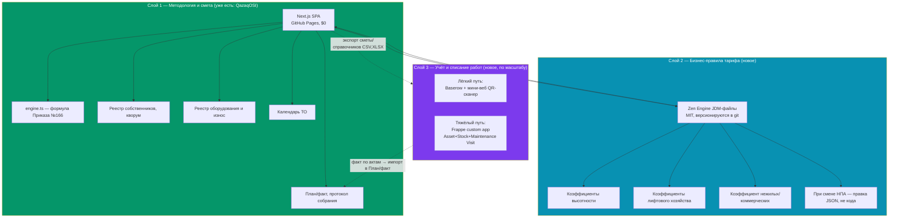
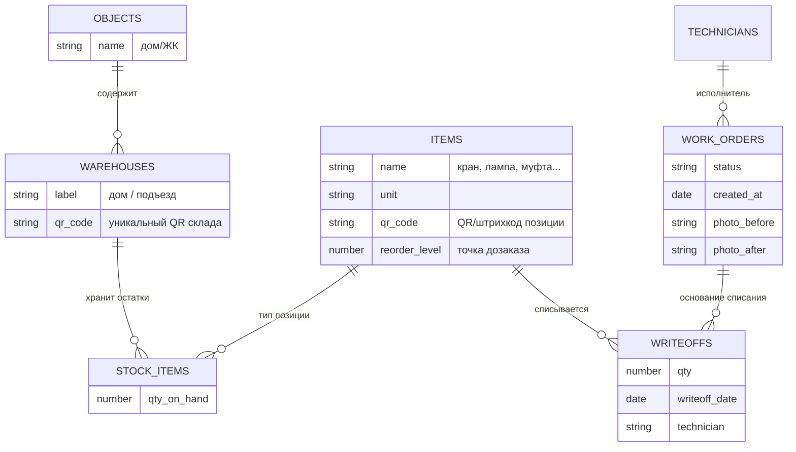

# Open Source архитектура «тариф + учёт и списание работ» для ОСИ/ПТ РК

Статус: рабочий архитектурный документ. Дата: 2026-09-11.
Автор роли: IT-архитектор + методолог ЖКХ РК (независимый разбор, не маркетинг конкретного вендора).

---

## TL;DR — вердикт сразу

- **Монолитный Frappe/ERPNext как единая платформа — не рекомендую как первый шаг.** Он решает половину задачи (учёт работ/ТОиР/склад) отлично, но для «тарифного калькулятора по Приказу №166» — это чужеродная предметная область, которую придётся моделировать поверх ERP с нуля (недели кастомной разработки, не «коробка»). Плюс он требует постоянного сервера (VPS, MariaDB, Redis, supervisor) — это прямо противоречит вашему же решению держать QazaqOSI как бесплатный статический сайт на GitHub Pages.
- **В вашем брифе две фактические ошибки, которые нужно исправить до принятия решения:**
  1. **MaintainX — не Open Source.** Это закрытый SaaS (GetMaintainX Inc.), публичного репозитория с исходным кодом продукта нет. То, что нашлось на GitHub под именем MaintainX — сторонние ETL/демо-интеграции с их платным API, не сам продукт.
  2. **NocoDB с версии 0.301.0 (2026 г.) — уже не полноценный Open Source.** Проект перешёл с AGPLv3 на Sustainable Use License (source-available, не OSI-совместимая). Для нового self-hosted проекта в 2026 году это риск. Прямая открытая замена — **Baserow** (ядро на MIT, платные функции — отдельный proprietary-плагин, но это не блокирует self-host).
- **Рекомендуемая архитектура — гибридная, не монолит:** QazaqOSI (уже написанный тариф-движок, разберу ниже) остаётся отдельным слоем «методология/смета». Для «учёт и списание работ» — отдельный лёгкий бэкенд (я дам два варианта: серьёзный на Frappe custom-app и лёгкий на Baserow + Zen Engine). Слои связаны через API/экспорт, а не слиты в один монолит.

---

## 1. Коррекция вводных: что проверено, а что нет

| Продукт | Open Source? | Лицензия | Проверенный статус (2026) | Вывод |
|---|---|---|---|---|
| **Frappe** (фреймворк) | Да | MIT | Активно поддерживается, стабильно | Безопасная база для *своего* приложения |
| **ERPNext** (приложение на Frappe) | Да | **GPL-3.0**, не MIT | Активная разработка | Копилефт — см. раздел 8 |
| **openMAINT / CMDBuild** | Да | Open source (на базе CMDBuild) | [Предположение] Найден GitHub-org `openmaint`, но чёткого сигнала об активном мейнтенансе в 2026 г. я не получил — стек тяжёлый (Java + OrientDB), у экосистемы CMDBuild были периоды низкой активности. **Проверьте дату последнего коммита и открытые issues перед выбором.** | Технически валиден, операционно рискован |
| **MaintainX** | **Нет** | Проприетарный SaaS | Подтверждено — нет паблик-репо продукта | Исключить из списка Open Source |
| **Part-DB / Part-DB-server** | Да | AGPL-3.0 | Активный проект, реален QR/баркод-генератор и сканер через веб-камеру. **NFC явно не подтверждён** в официальной документации — это придётся добавлять самим (Web NFC API в браузере/мобильном скан-приложении) | Годен как основа, требует доработки под NFC |
| **gorules/zen** | Да | **MIT** | Активный, кроссплатформенный (Rust core + байндинги Node/Python/Go/Java/.NET/Swift/Kotlin) | Хороший выбор — обоснование ниже |
| **CacheControl/json-rules-engine** | Да | MIT | Активный, но JS-only, без визуального редактора таблиц решений | Слабее Zen для этой задачи |
| **NocoDB** | Формально да, но с 0.301.0 — **source-available**, не открытый | Sustainable Use License (после AGPLv3) | Подтверждено сообществом и самим репо | Не рекомендую для нового внедрения в 2026 |
| **Baserow** | Да (ядро) | Core: MIT; premium/enterprise: proprietary add-on | Активный, self-host без ограничений на данных | Прямая замена NocoDB |

---

## 2. Почему не «всё в Frappe/ERPNext»

Ваш бриф прав в том, что **готового коробочного продукта «смета ОСИ РК + учёт работ» в Open Source не существует** — формула Приказа МИИР РК №166 (`В = (Ргод − Дгод) / (Sполез × 12)`), деление статей на «управление»/«содержание» и требования Закона «О жилищных отношениях» (взнос на капремонт ≥0,005 МРП/м² и т.п.) — это узкоспециализированная казахстанская нормативка, которую ни один зарубежный CMMS/ERP не знает из коробки.

Но прежде чем брать Frappe как фундамент, взвесьте это:

**Что Frappe/ERPNext реально даёт бесплатно и хорошо:**
- `Asset` + `Asset Maintenance` + `Maintenance Schedule` / `Maintenance Visit` — почти готовый реестр оборудования с периодичностью ТО (то, что вы в QazaqOSI сейчас реализуете вручную в `maintenanceCalendar.ts`).
- `Stock`/`Item`/`Warehouse` — полноценный складской учёт списания расходников (краны, лампы, фитинги) с движением по местам хранения (дом/подъезд как `Warehouse`).
- `Buying`/`Purchase Order` — закупки у подрядчиков.
- Ролевая модель, реальная многопользовательская БД (MariaDB), REST/GraphQL API из коробки — то, чего у вашего нынешнего localStorage-only QazaqOSI принципиально нет.

**Чего Frappe НЕ даёт и что придётся строить самим:**
- Саму формулу тарифа и структуру статей 166-го Приказа — это будет отдельный кастомный DocType `Смета ОСИ` + Server Script на Python, **с нуля**, не «в несколько действий», как написано в брифе — это реалистично 2–4 недели работы одного бэкенд-разработчика, знающего Frappe, плюс тестирование на реальных сметах.
- Контроль нормативных пропорций управление/содержание — **проверьте формулировку в первоисточнике** (я не нашёл в открытых источниках прямого подтверждения жёсткого лимита «≤30% на управление» именно в тексте Приказа №166 — это может быть внутренняя практика конкретных УК/ОСИ, а не императивная норма закона; если у вас есть точная статья — сверьтесь и зафиксируйте в коде, не берите на веру мою память).
- **Хостинг.** Frappe — это Python + MariaDB + Redis + supervisor/nginx worker-стек. Минимум — отдельный VPS (от ~$10–20/мес за самый скромный инстанс, больше под нагрузку многих домов), плюс кто-то должен администрировать бэкапы, обновления, безопасность. Это прямо противоположно вашей текущей модели (статический сайт на GitHub Pages, $0 инфраструктуры) — переход на Frappe означает **новый операционный бюджет и новую роль DevOps**, не бесплатное расширение существующего.

**Вывод:** Frappe оправдан, если вы планируете вырасти из «калькулятор для одного дома» в «SaaS для управления многими домами с реальным штатом техников» — тогда это правильная тяжёлая платформа. Если горизонт — 1–5 объектов и председатель/бухгалтер как единственные пользователи, это избыточно дорого и рано.

---

## 3. Рекомендуемая архитектура

Ключевая идея: **слои не сливаются в один монолит**, а обмениваются данными через файлы/API. Это соответствует тому, как это реально устроено на практике (вы сами описали этот паттерн в конце брифа) — просто я формализую его и выбираю конкретные инструменты в каждом слое, с поправкой на реальный статус их лицензий.

---

## 4. Слой 2 — движок бизнес-правил тарифа (Zen Engine, не json-rules-engine)

**Почему Zen, а не CacheControl/json-rules-engine:**

| Критерий | Zen Engine (gorules) | json-rules-engine |
|---|---|---|
| Визуальный редактор таблиц решений | Да (GoRules Editor, можно self-host) | Нет |
| Язык модели | Портативный JSON (JDM), кроссплатформенный | JS-специфичный объект |
| Где выполняется | Node.js **и** нативно в Rust/WASM — можно встроить прямо в статический сайт через WASM без бэкенда! | Только Node/браузер JS |
| Лицензия | MIT | MIT |
| Подходит для правок непрограммистом (бухгалтер/методолог) | Да, через визуальный редактор | Нет, только через код |

Практическая реализация для QazaqOSI:
1. Коэффициенты, которые сейчас зашиты в `presets.ts`/`engine.ts` как TypeScript-константы (мультипликатор класса обслуживания, коэффициент нежилых, `capitalRepairMrpMultiplier` и т.п.), выносятся в `.jdm.json`-файлы — по одному на смысловой блок: `class-multiplier.jdm.json`, `elevator-coefficient.jdm.json`, `commercial-rate.jdm.json`.
2. Zen Engine (пакет `@gorules/zen-engine`, WASM-сборка) подключается в `src/lib/calculator/engine.ts` вместо части `if/else`-логики.
3. Правки при изменении НПА — это правка JSON-файла и коммит, ревьюер видит diff как обычный текст, **не трогая TypeScript**. Это прямой ответ на ваш тезис «не зашивать логику в код».
4. Дальше, если экосистема вырастет до нескольких городов с разными решениями маслихатов по минимальному тарифу — те же JDM-файлы можно редактировать через self-hosted GoRules Editor силами методолога, без разработчика.

**Честная оговорка:** для сегодняшнего масштаба QazaqOSI (один расчётный движок, несколько пресетов) это архитектурно правильно, но не критично срочно — выигрыш ощутим, когда правил станет действительно много (несколько регионов, несколько версий методики одновременно). Если горизонт — 1 регион и стабильная методика, можно отложить до момента, когда изменения в коэффициентах реально начнут requiring frequent code review.

---

## 5. Легковесная QR/NFC инвентаризация — свой дизайн (не готовый Part-DB как есть)

Part-DB — реальный и добротный проект, но спроектирован под **электронные компоненты** (datasheets, footprints, производители) — для «краны, лампы, муфты, фитинги, инструменты» это оверкилл по доменной модели и лишний PHP/Symfony/MySQL стек, который тоже требует сервера.

Для ОСИ/ПТ масштаба (одна или несколько сервисных бригад, склад на дом/подъезд) предлагаю минимальную схему, которая **реализуется как расширение уже существующего Слоя 3 (Baserow)**, без отдельного продукта:

### Модель данных (таблицы Baserow)

### QR/NFC-сценарий списания (мобильный веб, без нативного приложения)

1. Каждая позиция склада и каждый склад (дом/подъезд) получает QR-этикетку — печатается прямо из Baserow (есть готовые формулы/интеграции генерации QR по значению поля, либо простая генерация на стороне мини-веб-обёртки через `qrcode`-библиотеку, MIT).
2. Техник открывает PWA-страницу (можно как ещё одну вкладку в QazaqOSI или отдельный лёгкий Next.js/Vite мини-сайт) — сканирует QR склада через `BarcodeDetector`/`@zxing/browser` API камеры телефона (работает в мобильном браузере, не требует установки приложения).
3. Сканирует QR/NFC позиции (Web NFC API — поддержан в Chrome for Android; на iOS Safari Web NFC не поддерживается на момент 2026 г. — **это ограничение платформы, не библиотеки**, стоит явно предупредить бригаду, если у техников iPhone: для iOS остаётся QR через камеру, NFC отпадает).
4. Вводит количество, прикладывает фото акта — данные пишутся через Baserow REST API (`POST /api/database/rows/table/{id}/`) в таблицу `WRITEOFFS`, и триггером (Baserow automations, либо простой webhook) списывается остаток в `STOCK_ITEMS`.
5. В конце месяца `WRITEOFFS`, сгруппированные по дому/статье, экспортируются (CSV/XLSX через Baserow API) и импортируются в модуль «План/факт» QazaqOSI как фактические расходы (переиспользуя уже реализованный парсер `parsePriceList.ts`/аналогичный).

Это реалистичный MVP на несколько недель одного full-stack разработчика — сильно легче, чем разворачивать Part-DB или Frappe ради этой одной функции, и полностью совместимо с текущим «дешёвым» вектором проекта.

---

## 6. Слой 3, тяжёлый путь — если всё-таки Frappe

Если решите расти до Frappe (оправдано при управлении портфелем из многих объектов с реальным штатом техников и бухгалтерией), вот конкретный, а не абстрактный план модулей:

| Задача | DocType/модуль Frappe | Готовность из коробки |
|---|---|---|
| Реестр оборудования дома | `Asset` (custom fields: дом, подъезд, категория) | 80% — переименовать поля |
| График ППР | `Maintenance Schedule` + `Maintenance Schedule Item` | 90% — периодичность уже есть |
| Наряд-заказ технику | `Maintenance Visit` (или `Maintenance Team`/кастомный DocType, если нужны фото/подписи) | 70% — базовый workflow есть, фотоотчёты потребуют custom field |
| Списание расходников | `Stock Entry` (Material Issue) с `Warehouse` = дом/подъезд | 85% |
| Закупка у подрядчика | `Purchase Order` → `Purchase Invoice` | 95% |
| Смета/тариф по Приказу №166 | **Ничего готового.** Кастомный DocType `Смета` + `Статья сметы` (child table) + Server Script с формулой | 0% — писать с нуля |
| План/факт | `Project` + `Cost Center` бюджетирование, либо кастомный отчёт | 40% — есть примитивы, нужна доработка под структуру статей 166 |
| Протокол собрания/кворум | Ничего готового — нет доменной модели «голос = площадь» | 0% — писать с нуля |

**Важно по лицензии:** если вы пишете кастомные DocType/Server Script как **отдельное Frappe-приложение** (`bench new-app kondominium`), а не патчите файлы внутри `erpnext`, — само это приложение вы вправе лицензировать как захотите (проприетарно, для продажи как SaaS), потому что оно технически зависит от MIT-фреймворка Frappe, а не является производной работой от GPLv3-кода ERPNext (если вы вообще не устанавливаете ERPNext, а используете только Frappe Framework + Frappe HR-подобный паттерн отдельного приложения). Если же вы форкаете/патчите сам `erpnext`, копилефт GPLv3 распространяется на эти изменения. **Это не заменяет консультацию юриста**, но задаёт архитектурное правило: держите свой код в отдельном app, не трогайте `erpnext` core.

---

## 7. Итоговая матрица решений

| Компонент | Рекомендация | Альтернатива | Не рекомендую |
|---|---|---|---|
| Тариф/смета (Приказ №166) | QazaqOSI как есть (уже реализовано и работает) | — | Переносить в Frappe с нуля без явной бизнес-причины |
| Правила/коэффициенты | Zen Engine (JDM JSON) | Оставить как TS-константы, если правил мало | json-rules-engine (слабее для визуальных таблиц) |
| Реестр собственников/кворум/протокол | QazaqOSI (уже реализовано) | — | — |
| Учёт работ, ТОиР, склад — MVP/малый масштаб | Baserow + лёгкий QR-сканер (свой дизайн, раздел 5) | — | NocoDB (лицензионный риск), Part-DB как есть (не тот домен) |
| Учёт работ, ТОиР, склад — рост до SaaS на много домов | Frappe custom app (раздел 6) | openMAINT — **только после личной проверки актуальности репозитория** | MaintainX (не Open Source вообще) |

---

## 8. Риски, которые нужно принять осознанно

1. **Лицензионный дрейф.** NocoDB уже поменял лицензию в 2026 г. Baserow тоже открытый-core (не 100% MIT весь продукт) — если решите на неё опираться серьёзно, зафиксируйте версию и следите за анонсами лицензии так же внимательно.
2. **openMAINT — риск заброшенности.** Проверьте `git log` последнего коммита и открытые Issues лично перед тем, как на него полагаться — я не смог подтвердить активный мейнтенанс через поиск.
3. **Frappe — операционная стоимость, не только лицензионная.** $0 по лицензии ≠ $0 по эксплуатации (сервер, бэкапы, обновления, безопасность).
4. **Регуляторный риск в формуле.** Утверждение про лимит «≤30% на управление» нужно сверить с первоисточником Приказа №166 и актуальной редакцией Закона «О жилищных отношениях» перед тем, как зашивать как жёсткое правило (в текущем движке QazaqOSI такого ограничения нет — это сознательный выбор, не упущение).

---

*Документ подготовлен как разбор, не как маркетинг конкретного вендора. Ссылки на первоисточники — в истории поиска сессии; при использовании в реальном внедрении перепроверьте лицензии и статус активности репозиториев на дату принятия решения (лицензии open source проектов меняются, как показал случай NocoDB).*
