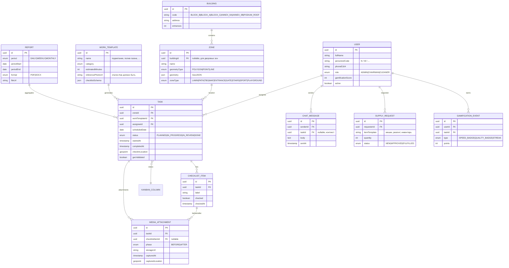

# ARCHITECTURE — Сервис эксплуатации территории ЖК (Ақмешіт 9/9А/9Б)

> Статус: MVP-архитектура. Не является финальным production-документом — требует
> ревью ИБ и нагрузочного тестирования перед запуском в эксплуатацию.

## 1. Границы системы

Система обслуживает один жилой комплекс с объектами:

| Тип | Идентификатор | Примечание |
|---|---|---|
| Жилой блок | `BLOCK_B` (Ақмешіт 9) | 2 подъезда, крыльца, выходы во двор, 3 выхода из нежилых помещений |
| Жилой блок | `BLOCK_A` (Ақмешіт 9/1) | аналогично |
| Жилой блок | `BLOCK_C` (Ақмешіт 9/2) | аналогично |
| Пристройка | `ANNEX_9A` (Ақмешіт 9А) | нежилое |
| Пристройка | `ANNEX_9B` (Ақмешіт 9Б) | нежилое |
| Стилобат | `PODIUM_ROOF` | футбольное поле, тренажёрная зона, детская площадка |
| Инфраструктура двора | `YARD_TBO`, `YARD_STAIRS_1/2`, `YARD_GATE_MAIN` (откатные, 2 калитки), `YARD_GATE_2` | точечные объекты на карте |

Персонал на старте: `Никита` (код `N`), `Владимир` (код `W`) — справочник расширяемый,
коды жёстко не кодируются в логике, только в seed-данных.

## 2. Ролевая модель

| Роль | Доступ |
|---|---|
| `ADMIN` | полный доступ, управление справочниками, пользователями, зонами карты |
| `CHAIRMAN` | канбан, аналитика, отчёты, чат, назначение задач, не может менять системные справочники |
| `CLEANER` | только свои задачи на сегодня, чек-листы, чат, раздел «Потребности» |

Авторизация:
- `ADMIN`/`CHAIRMAN` — логин/пароль + JWT (Spring Security).
- `CLEANER` — WhatsApp Magic Link (OTP через Green API/WhatsApp Cloud API), без пароля.
  Ссылка одноразовая, TTL 15 минут, привязана к `userId` + `deviceFingerprint`.

Все эндпоинты защищены `@PreAuthorize` по ролям, дополнительно задачи фильтруются
по `assigneeId` для `CLEANER` (нельзя увидеть чужую задачу по id).

## 3. ER-диаграмма (основные сущности)

## 4. API-эндпоинты (REST, `/api/v1`)

### Auth
- `POST /auth/whatsapp/request-otp` — `{ phone }` → отправка OTP/magic link через Green API
- `POST /auth/whatsapp/verify` — `{ phone, otp }` → JWT (роль CLEANER)
- `POST /auth/login` — логин/пароль для ADMIN/CHAIRMAN
- `POST /auth/refresh`

### Справочники и карта
- `GET /buildings`
- `GET /zones?buildingId=`
- `POST /zones` (ADMIN) — сохранение GeoJSON-полигона/точки
- `PUT /zones/{id}` / `DELETE /zones/{id}`
- `GET /work-templates`
- `POST /work-templates` (ADMIN/CHAIRMAN)

### Задачи и планирование
- `GET /tasks?date=&assigneeId=&status=` — список/канбан
- `POST /tasks` — создание (одиночное или из шаблона расписания)
- `POST /tasks/bulk-schedule` — генерация задач на период по шаблону
- `PATCH /tasks/{id}/assign` — `{ assigneeId }`
- `PATCH /tasks/{id}/status` — переход по канбану
- `POST /tasks/{id}/checklist/{itemId}/check` — `{ geolocation }` (с геовалидацией)
- `POST /tasks/{id}/media` — multipart upload (before/after)
- `POST /tasks/{id}/dispatch-whatsapp` — отправка персональной ссылки на задачу

### Чат (REST — история; realtime — WebSocket ниже)
- `GET /chat/messages?taskId=`
- `POST /supply-requests`
- `GET /supply-requests?status=`

### Аналитика и отчёты
- `GET /analytics/dashboard?period=`
- `POST /reports/generate` — `{ period, format: PDF|DOCX, dateFrom, dateTo }` → 202 + `reportId`
- `GET /reports/{id}/download`

### WebSocket
- `/ws/chat` (STOMP) — топики `/topic/chat/{taskId}`, `/topic/chat/general`

## 5. Безопасность

- JWT (RS256), access 15 мин / refresh 14 дней, refresh хранится httpOnly cookie.
- Geo-валидация чек-листа: серверная проверка `haversine(checkInLocation, zone.centroid) <= zone.radiusMeters`;
  при провале — пункт помечается `geoValidated=false`, попадает в очередь ручной проверки председателя,
  не блокирует выполнение (чтобы не парализовать работу при плохом GPS), но видно в аналитике.
- Rate-limit на `/auth/whatsapp/request-otp` (per phone + per IP) — защита от флуда OTP.
- Медиа хранится в S3-совместимом бакете с presigned URL, приватный доступ по умолчанию.
- Все action-эндпоинты идемпотентны там, где возможно (дедупликация по `Idempotency-Key`
  для дозвона WhatsApp/повторной отправки).

## 6. Отчёты (PDF/DOCX)

`ReportGeneratorService` собирает данные за период → `ReportDataAggregator` (задачи, время,
% закрытия, медиа) → рендер:
- PDF — OpenPDF, шаблон с таблицами и галереей (сжатие JPEG до ≤200KB на превью).
- DOCX — Apache POI, аналогичная структура для редактируемого отчёта председателю.

Генерация асинхронная (`@Async` + очередь), результат кладётся в S3, ссылка отдаётся по `reportId`.

## 7. Открытые вопросы (требуют решения владельца продукта, не техническая догадка)

- [Предположение] Провайдер WhatsApp — Green API или Cloud API официальный — не указано,
  архитектура рассчитана на абстракцию `WhatsAppGateway` с двумя реализациями.
- Нужна ли офлайн-поддержка чек-листа (PWA service worker с очередью синхронизации) —
  критично для подземного паркинга/стилобата, где может не быть сети.
